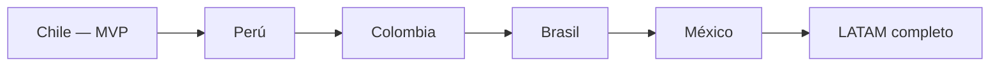
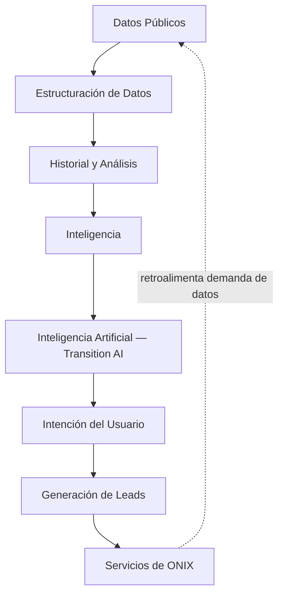

# 01 — Visión de Producto: Transition LATAM

## 1.1 Qué es

Transition LATAM es una **plataforma de inteligencia de mercado para la transición energética en Latinoamérica**, propiedad de ONIX Consulting Group. No es un sitio de noticias ni una base de datos plana de proyectos: es un sistema que convierte datos públicos y semi-públicos en inteligencia estructurada, y esa inteligencia en oportunidades comerciales calificadas para ONIX.

No confundir con el producto final: el producto final para el usuario es *inteligencia y análisis*. El dataset bruto es un insumo, no el producto — esto es la base de todo el modelo de protección de datos (ver [09-seguridad.md](09-seguridad.md)) y de monetización (ver [08-modelo-suscripciones.md](08-modelo-suscripciones.md)).

## 1.2 Por qué existe

ONIX Consulting Group (https://www.onixcg.com) es una consultora de energía, infraestructura, entrada a mercados y desarrollo de negocios en LATAM. Transition LATAM existe para resolver un problema estructural de ese negocio: **la generación de leads calificados depende hoy de relaciones y prospección manual**. La plataforma automatiza la primera mitad del embudo (descubrimiento, educación, calificación de intención) y entrega a ONIX oportunidades ya tibias o calientes.

> Transition LATAM es, ante todo, **un motor de adquisición de clientes para ONIX**, empaquetado como una herramienta de inteligencia de mercado que el usuario percibe como valiosa por sí misma.

Esta dualidad (valor percibido por el usuario vs. valor real para el negocio) debe estar presente en cada decisión de producto. Nunca se sacrifica la utilidad real para el usuario — un producto que se siente como "solo un formulario de captura de leads disfrazado" fracasa. El valor debe ser genuino primero; el lead es una consecuencia del valor entregado, no el objetivo explícito frente al usuario.

## 1.3 Alcance geográfico y evolución

El MVP es **exclusivamente Chile**. Toda decisión de arquitectura (modelo de datos, i18n, monedas, unidades regulatorias como el SEIA) debe asumir que el país es un **parámetro**, no una constante hardcodeada — pero sin construir la generalización completa antes de que exista una segunda instancia real (Perú). Ver principio de "no sobreconstruir" en [10-roadmap-mvp.md](10-roadmap-mvp.md).

## 1.4 El loop central del producto

Este es el principio organizador de todo el sistema. Cada módulo de producto debe poder ubicarse en este flujo:

Cualquier feature que no pueda ubicarse en este loop, o que no fortalezca alguno de sus eslabones, es candidata a **no construirse** en el MVP.

## 1.5 Ventaja competitiva

La ventaja competitiva de largo plazo no es tener datos de proyectos (eso es replicable). Es:

1. **Historial** — nadie más reconstruye la línea de tiempo de cambios de un proyecto (ownership, capacidad, fechas, estado SEIA) a través del tiempo.
2. **Proveniencia y confianza** — el sistema distingue explícitamente entre lo verificado, lo público, lo confirmado por el propietario, la inteligencia de mercado y lo estimado. Ningún competidor informal (spreadsheets, boletines) hace esto de forma sistemática.
3. **Relaciones entre entidades** — el grafo de quién-posee-qué-y-quién-desarrolla-qué es donde vive la inteligencia comercial real para ONIX.
4. **Transition AI** como capa de interpretación sobre 1–3, no como generador de contenido independiente.

## 1.6 Qué NO es Transition LATAM (para evitar deriva de producto)

- No es un agregador de noticias energéticas.
- No es una base de datos exportable (CSV/Excel) — ver [09-seguridad.md](09-seguridad.md).
- No es un CRM — se integra con el CRM de ONIX, no lo reemplaza.
- No es, en el MVP, un marketplace transaccional entre desarrolladores/inversionistas/EPCistas.
- No es un producto SaaS de suscripción como modelo de ingreso primario en el MVP (ver [03-modelo-negocio.md](03-modelo-negocio.md)).

## 1.7 Definición de éxito del MVP

El MVP en Chile se considera exitoso si, dentro de los primeros 2–3 meses post-lanzamiento:

- Genera tráfico orgánico medible y creciente (SEO/dashboard público).
- Produce usuarios registrados con señales de intención capturables.
- Entrega a ONIX al menos un flujo constante de leads calificados (no necesariamente en volumen alto — la calidad es la métrica, no el volumen).
- El modelo de datos y la arquitectura no requieren reescritura para soportar un segundo país.

Ver métricas concretas en [03-modelo-negocio.md](03-modelo-negocio.md) y alcance exacto en [10-roadmap-mvp.md](10-roadmap-mvp.md).
