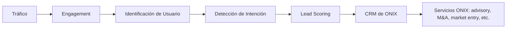

# 03 — Modelo de Negocio

## 3.1 Tesis central

Transition LATAM no vende datos ni (inicialmente) suscripciones. Vende, a través de ONIX, **acceso acelerado a oportunidades comerciales en la transición energética latinoamericana**. El producto digital es el mecanismo de captura y calificación; el negocio real se cierra en los servicios de consultoría/advisory de ONIX.

## 3.2 Prioridad de negocio (orden explícito, no simultáneo)

1. Generar tráfico.
2. Generar engagement.
3. Identificar usuarios.
4. Detectar intención.
5. Calificar leads.
6. Convertir oportunidades para ONIX.
7. *(Secundario, no bloqueante para el MVP)* Monetizar directamente vía suscripciones.

Cualquier decisión de producto que mejore el paso N a costa del paso N+1 es aceptable; lo contrario (optimizar suscripciones a costa de tráfico/engagement) no lo es en esta fase.

## 3.3 Funnel y estados

| Etapa | Estado del usuario | Dato capturado | Sistema responsable |
|---|---|---|---|
| Exploración pública | Anónimo | Analytics agregado (no PII) | Dashboard/Mapa |
| Engagement | Anónimo con sesión | Eventos de comportamiento (session-scoped) | Tracking de eventos |
| Consulta a Transition AI | Anónimo (límite bajo) o registrado | Consultas realizadas | Transition AI |
| Registro | Identificado | Nombre, email, empresa, cargo, país, industria, tipo de usuario, intereses | Onboarding |
| Detección de intención | Identificado + comportamiento | Engagement Score, Intent Score | Intent Engine (ver [07](07-inteligencia-leads.md)) |
| Lead calificado | Lead | ONIX Opportunity Score ≥ umbral | Lead Scoring |
| Oportunidad ONIX | Lead exportado | Payload de lead + contexto | Integración CRM |

## 3.4 Categorías de usuario (input al scoring, no solo taxonomía)

Developer, Investor, EPC, Technology Provider, Supplier, Financial Institution, Consultant, Corporate, Government, Other — ver definición completa y señales por persona en [02-prd.md](02-prd.md) §2.1.

## 3.5 Métricas de éxito del negocio (KPIs)

| KPI | Qué mide | Por qué importa |
|---|---|---|
| Visitas orgánicas / mes | Tracción de SEO y contenido | Sin tráfico no hay funnel |
| % de visitantes que interactúan con Transition AI o el mapa | Engagement real vs. bounce | Valida que el producto entrega valor percibido |
| Tasa de registro | Conversión de anónimo a identificado | Primer punto de fricción medible |
| # de leads con Opportunity Score alto / mes | Calidad del funnel, no volumen | Alineado con la prioridad de calidad sobre cantidad |
| % de leads aceptados/trabajados por el equipo comercial de ONIX | Calidad real percibida por el consumidor interno del dato | Métrica de "cierre del loop" — sin esto el resto es vanidad |
| (Futuro) MRR de suscripciones | Monetización directa | Secundario en el MVP, se activa en fase posterior |

## 3.6 Modelo de monetización por fases

- **Fase MVP:** sin cobro directo. El "cliente" que paga es ONIX internamente (el producto es una inversión de adquisición de clientes).
- **Fase de crecimiento:** introducción de planes Free/Lite/Premium (ver [08-modelo-suscripciones.md](08-modelo-suscripciones.md)), con contratación anual por empresa y diferenciación progresiva entre exploración, análisis/seguimiento y gestión comercial asistida por IA.
- **Fase LATAM:** posible modelo híbrido — suscripción para acceso a inteligencia profunda multi-país + generación de leads país por país para las oficinas locales de ONIX.

## 3.7 Riesgo de negocio a vigilar

Si el equipo comercial de ONIX no tiene capacidad de trabajar el volumen de leads generado, el producto genera una falsa sensación de éxito (muchos leads, pocos cerrados). Se recomienda medir explícitamente la tasa de "leads trabajados" desde el primer mes, no solo "leads generados" (ver KPI en §3.5).
