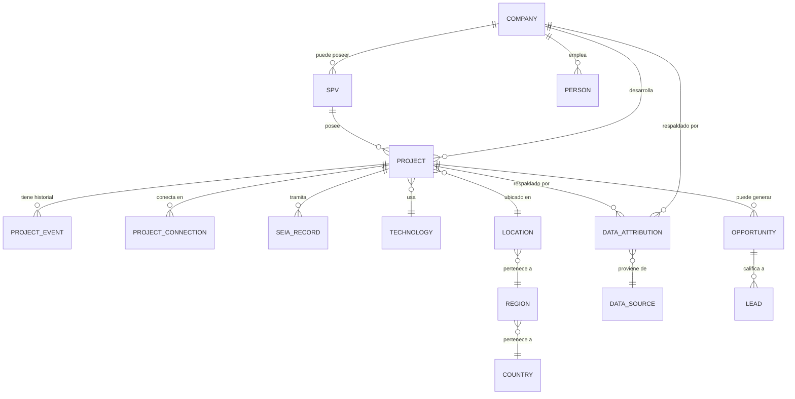

# 04 — Modelo de Datos

## 4.1 Principio de diseño

Relacional (PostgreSQL) desde el día 1, con una capa explícita de **relaciones tipadas entre entidades** que permite, sin migrar de motor, comportarse como un grafo de consulta cuando el caso de uso lo requiera (ver §4.5 y ADR-002 en [DECISIONS.md](DECISIONS.md)). No se introduce una base de datos de grafo dedicada en el MVP — es complejidad prematura (principio §22 del brief).

## 4.2 Entidades principales

| Entidad | Descripción |
|---|---|
| `country` | País (Chile en MVP; tabla ya existe para soportar expansión) |
| `region` | Región/división administrativa dentro de un país |
| `location` | Ubicación puntual (lat/lng, comuna, dirección) |
| `technology` | Catálogo de tecnologías (Solar PV, Eólica, BESS, etc.) |
| `company` | Empresa (puede ser developer, owner, EPC, tech provider, investor — roles vía tabla de asociación, no columnas booleanas) |
| `spv` | Vehículo de propósito especial, referencia a `company` matriz cuando aplica |
| `person` (stakeholder) | Persona física asociada a una o más `company` |
| `project` | Proyecto energético — entidad central del dominio |
| `project_connection` | Punto e información de conexión a la red de un proyecto |
| `seia_record` | Registro/expediente SEIA asociado a un proyecto |
| `project_event` | Evento histórico de un proyecto (ver §4.4) |
| `entity_relationship` | Relación tipada genérica entre dos entidades cualesquiera (ver §4.5) |
| `data_source` | Fuente de datos (URL, tipo, fecha) |
| `data_attribution` | Tabla puente: qué fuente respalda qué valor de qué campo, con nivel de confianza |
| `opportunity` | Oportunidad comercial derivada de uno o más proyectos/empresas |
| `market_signal` | Señal de mercado (anuncio, noticia, evento) no necesariamente atada a un proyecto formal |
| `lead` | Usuario/organización calificado como oportunidad para ONIX (ver [07-inteligencia-leads.md](07-inteligencia-leads.md)) |
| `user_profile` | Perfil de usuario de la plataforma (distinto de `lead`; todo lead es un `user_profile`, no todo `user_profile` es un lead) |
| `organization` (de plataforma) | Organización/cuenta para B2B multi-usuario y billing (ver [08](08-modelo-suscripciones.md)) |

## 4.3 Modelo de proveniencia y confianza (obligatorio, no opcional)

Cada valor de dato relevante debe poder rastrear su origen. En vez de columnas de metadata repetidas por tabla, se centraliza en `data_attribution`:

```
data_attribution
  id
  entity_type        -- 'project', 'company', 'spv', ...
  entity_id
  field_name          -- 'capacity_mw', 'ownership', 'estimated_connection_date', ...
  value               -- jsonb, valor tal cual reportado por esta fuente
  data_source_id      -- FK a data_source
  source_date         -- fecha del dato en la fuente
  collected_at         -- fecha de recopilación por Transition LATAM
  confidence_level     -- enum: ver abajo
  verification_status  -- enum: ver abajo
  is_current            -- boolean, si es el valor vigente mostrado
```

**Niveles de confianza (`confidence_level`):**

`VERIFICADO` → `CONFIRMADO_POR_PROPIETARIO` → `PUBLICO` → `INTELIGENCIA_DE_MERCADO` → `ESTIMADO`

**Estado de verificación (`verification_status`):** `verified`, `unverified`, `disputed`, `outdated`.

Regla de producto no negociable: la UI y Transition AI **deben** mostrar el nivel de confianza junto al dato cuando este no sea `VERIFICADO`, y nunca deben presentar un `ESTIMADO` con el mismo tratamiento visual/textual que un `VERIFICADO`. Esto es un requisito de integridad reputacional para ONIX, no solo una preferencia de UX.

Un mismo campo puede tener múltiples `data_attribution` de distintas fuentes en el tiempo — esto es lo que habilita el historial (§4.4) y la detección de discrepancias entre fuentes.

## 4.4 Historial de proyectos (event sourcing ligero)

En vez de solo mantener el estado actual de `project` y sobrescribirlo, cada cambio relevante genera un registro en `project_event`:

```
project_event
  id
  project_id
  event_type      -- 'announced','capacity_change','ownership_change','developer_change',
                   -- 'connection_date_change','construction_date_change','status_change',
                   -- 'seia_milestone','delay','other'
  occurred_at      -- fecha del evento (real o estimada)
  recorded_at      -- fecha en que Transition LATAM lo detectó/registró
  previous_value   -- jsonb, nullable
  new_value        -- jsonb
  data_source_id
  confidence_level
  description
```

La tabla `project` mantiene el **estado actual materializado** (para performance de consultas comunes); `project_event` es la fuente de verdad histórica. La línea de tiempo de un proyecto se renderiza consultando `project_event` ordenado por `occurred_at`.

## 4.5 Relaciones entre entidades

Para evitar explosión de tablas puente (`project_company`, `company_person`, `spv_company`, …) y preparar el terreno para el futuro Knowledge Graph, se usa una tabla de relaciones tipadas genérica además de las FKs directas obvias (ej. `project.spv_id`):

```
entity_relationship
  id
  source_type      -- 'project' | 'company' | 'spv' | 'person' | ...
  source_id
  relationship_type -- 'developed_by','owned_by','connected_to','represents_opportunity',
                     -- 'employs','holds_position_at','partnered_with', ...
  target_type
  target_id
  valid_from
  valid_to           -- nullable, permite relaciones históricas/expiradas
  data_source_id
  confidence_level
```

Las relaciones estructurales de alta frecuencia (proyecto→SPV, proyecto→ubicación, proyecto→tecnología) se modelan como FK directas por rendimiento; las relaciones de negocio/menos frecuentes (stakeholder↔cargo, empresa↔alianza) usan `entity_relationship`. Ambas conviven — no es una u otra.

## 4.6 Resolución de entidades y de-duplicación

Cada entidad tiene un identificador interno estable (`uuid`) independiente de cualquier identificador externo. Se mantiene una tabla `entity_alias` (nombre alternativo/razón social previa/nombre de fantasía → entidad canónica) para resolver duplicados durante la ingesta. La de-duplicación en el MVP es semi-asistida (candidatos sugeridos por similitud de nombre/RUT, confirmación humana en el panel de admin) — un motor de resolución automática con ML es explícitamente post-MVP.

## 4.7 Diagrama simplificado (MVP)



## 4.8 Fuente confirmada: "Acceso Abierto" (Coordinador Eléctrico Nacional) — listado + Formulario por proyecto

El archivo `dataset/solicitudes_muestra.xlsx` provisto por ONIX (2758 filas, 28 columnas) corresponde al listado público de **solicitudes de conexión al sistema eléctrico** del portal `accesoabierto.coordinador.cl` (ver detalle técnico del sitio en [05-arquitectura-tecnica.md](05-arquitectura-tecnica.md) §5.10). ONIX confirmó (§4.9) que este listado y "Energía Abierta" son, a efectos de este proyecto, la misma fuente. Es una fuente de altísimo valor porque ya trae, por sí misma, un **estado de avance por solicitud** (`Estado Solicitud`) que es exactamente el tipo de señal que necesitamos para poblar `project_event` en cada corrida de ingesta.

**Regla de precedencia entre las dos fuentes (confirmado por ONIX 2026-07-20):** el **Excel del Nivel 1 es la fuente principal/autoritativa de los atributos del proyecto** (capacidad, tecnología, fechas, estado, punto de conexión, región/comuna) — es lo que ya mapeamos en la tabla de abajo y lo que alimenta `project`/`project_event`. El **Formulario del Nivel 2 es la fuente autoritativa de contacto y ubicación fina del gestor/empresa** (nombre, teléfono, y detalle de ubicación más preciso que la Región/Comuna del Excel) — alimenta `person`/`entity_relationship`/`company` (§4.2, §4.5), no reemplaza ni duplica los atributos del proyecto que ya vienen del Excel. En caso de conflicto entre ambas fuentes para un mismo campo de proyecto (poco esperable, pero posible), el Excel manda por ser la fuente principal.

**Segundo nivel — documento "Formulario" por proyecto:** ONIX identificó que, entrando al detalle de cada proyecto (ícono de "ojo" en el listado), siempre existe un documento llamado **Formulario** con quién gestiona el proyecto (nombre, teléfono, contacto) y de qué **empresa/SPV** depende. Este documento es la fuente primaria para poblar:
- `person` — el/la gestor(a) de contacto del proyecto (stakeholder).
- `entity_relationship` — `person` → `holds_position_at` → `company`, y `project` → `owned_by`/`developed_by` → `spv`/`company` (confirma la relación proyecto-SPV-empresa matriz descrita en §4.5).
- `company`/`spv` — datos de contacto adicionales no presentes en el listado agregado.

Es un dato de **contacto de persona natural** (teléfono, nombre) — se trata como dato personal a efectos de privacidad (ver [09-seguridad.md](09-seguridad.md) §9.7), no solo como dato de mercado.

**Confirmado con captura real del modal "Documentos Solicitud" (2026-07-20):** el detalle de cada proyecto no tiene un único archivo sino una **lista de documentos** por solicitud, con columnas `Tipo` y `Nombre`, entre ellos:
- `Carta Conductora` (ej. `GREENGATE_-_CEN_SAC_Proyecto_SAND.pdf`) — el nombre del archivo ya trae, de forma no confiable pero útil como pista, el nombre de la empresa solicitante.
- `Formulario SAC` / previsiblemente `Formulario SUCTD` / `Formulario FEHACIENTE` según el `Tipo` de la solicitud (ej. `Formulario-de-solicitud-y-antecedentes-SAC-SAND_ver1_(2).pdf`) — **formato confirmado: PDF**. Puede haber **múltiples versiones** del mismo formulario (`ver1_(1)`, `ver1_(2)`, …) — el conector debe quedarse con la versión más reciente por defecto, sin descartar las anteriores del storage crudo (útil para auditoría).
- Existe un botón **"Descargar Todo"** que baja todos los documentos de la solicitud de una vez — coincide con la ruta `/documentos/s3/zip` ya identificada de forma pasiva en el bundle de la app (ver [05-arquitectura-tecnica.md](05-arquitectura-tecnica.md) §5.10), lo que confirma esa ruta como la vía natural para el conector (un zip por solicitud en vez de descargar archivo por archivo).

Esto reemplaza la suposición inicial de "un solo archivo Formulario" — el modelo de ingesta debe tratar el resultado como una **colección de documentos por solicitud**, de los cuales `Formulario SAC/SUCTD/FEHACIENTE` es el relevante para extraer stakeholder/contacto/SPV, y `Carta Conductora` es una señal secundaria útil para resolución de entidades (nombre de empresa en el archivo).

**Mapeo de columnas del archivo → modelo de dominio:**

| Columna origen | Campo/entidad destino | Notas |
|---|---|---|
| `Id` | Clave natural de la solicitud (`external_id` en `project_connection` o `project`) | Es el candidato natural para el diff entre snapshots — estable en el tiempo (a confirmar con más de una corrida real) |
| `Proyecto` | `project.name` | |
| `NUP` | `project.external_reference` (nº único de proyecto, posible cruce futuro con SEIA) | Muchas filas de la muestra lo traen vacío |
| `Empresa Solicitante` | `company.name` (rol `developer`/`applicant` vía `entity_relationship`) | Candidato a resolución de entidades ([§4.6](04-modelo-datos.md#46-resolución-de-entidades-y-de-duplicación)) |
| `Tipo` (SAC / SUCTD / FEHACIENTES) | `project_connection.request_type` | Categorías del proceso regulatorio de conexión chileno — significado exacto de cada sigla a confirmar con ONIX/fuente regulatoria antes de mostrarlo al usuario final como texto interpretado (evitar presentar una interpretación nuestra como hecho verificado, principio de [§4.3](04-modelo-datos.md#43-modelo-de-proveniencia-y-confianza-obligatorio-no-opcional)) |
| `Estado Solicitud` (23+ valores distintos observados: `Rechazada`, `Desistida`, `Proyecto declarado en construcción`, `Proyecto autorizado para declararse en construcción`, `Clasificado como Obra Menor`, etc.) | Dispara `project_event` de tipo `status_change` cuando cambia entre corridas | Requiere tabla de normalización `connection_status` (valores con variantes de capitalización/tildes en la muestra, ej. `Proyecto declarado en construccion` vs `Proyecto declarado en construcción` — normalizar en `normalize.ts`) |
| `Fecha Recepción` | `project_event.occurred_at` (evento `announced`/ingreso de solicitud) | Formato largo en español con timestamp (`17 de julio de 2026 19:09:22.775`) — requiere parser dedicado |
| `Capacidad [MW]`, `Potencia de Generación [MW]`, `Potencia de Almacenamiento [MW]`, `Energia [MWh]`, `Horas de Almacenamiento [h]` | `project.capacity_mw`, `project.capacity_mwh` (BESS) | Cambios entre corridas → `project_event` tipo `capacity_change` |
| `Tipo Proyecto` (Generación/Consumo/SAE/CRCA/Transmisión) | `project.project_kind` | Nota: la muestra incluye solicitudes de **consumo** (demanda), no solo generación — el filtro de ingesta debe decidir si Transition LATAM solo modela proyectos de generación/almacenamiento o también consumo relevante para inteligencia comercial |
| `Tipo Tecnologia` (Solar, Eólico, Híbrido, Hidroeléctrica, Térmica, Almacenamiento, Baterías, Solar con Baterías, Biomasa, Geotérmica, Bombeo hidroeléctrico) | `technology` (catálogo) | "Híbrido" es la categoría más frecuente en la muestra (1042/2758) — probablemente Solar+BESS o Eólico+BESS; puede requerir sub-clasificación si el detalle importa para el negocio |
| `Fecha Estimada Conexión` | `project.estimated_connection_date` | Mismo formato de fecha en español que `Fecha Recepción` |
| `Punto de Conexión`, `Nivel de tension`, `Barra`, `Paño`, `Segmento de Transmisión` | `project_connection.*` | |
| `Región`, `Comuna` | `location.region_id`, `location.comuna` | Valores con acentos corruptos en la muestra (ver nota de encoding abajo) — normalizar contra catálogo propio de regiones/comunas de Chile, no confiar en el string crudo como clave |
| `Fecha emisión informe definitivo`, `Plazo obtención declaración en const`, `Prórroga plazo obtención declaración en const.` | `project_event` (eventos de hitos regulatorios) | Mayormente vacíos en la muestra — llenado progresivo según avanza cada solicitud |

**Nota técnica de encoding:** el XML interno del archivo declara UTF-8 pero contiene bytes inválidos en caracteres acentuados (`Región` aparece corrupto en la extracción cruda). El conector de ingesta debe probar explícitamente la codificación real de origen (candidatos: Windows-1252/Latin-1 mal etiquetado como UTF-8) antes de normalizar texto — de lo contrario los valores de `Región`/`Comuna`/nombres de empresa quedarán corruptos en la base de datos.

**Diseño del mecanismo de "contraste" (diff) pedido por ONIX:**

```
/lib/ingestion/sources/energia-abierta/
  fetch.ts        -- descarga la planilla/vista desde el punto de origen (URL a confirmar, ver pregunta abierta abajo)
  parse.ts         -- xlsx → filas tipadas, con manejo explícito de encoding
  normalize.ts      -- normaliza Estado Solicitud, Región/Comuna, fechas en español, Tipo Tecnologia
  diff.ts            -- por cada `Id`: compara contra el último snapshot guardado
                       -- si `Id` es nuevo → project_event 'announced'
                       -- si cambia Estado Solicitud → project_event 'status_change'
                       -- si cambia capacidad/energía → project_event 'capacity_change'
                       -- si cambia Fecha Estimada Conexión → project_event 'connection_date_change'
                       -- si un `Id` presente en el snapshot anterior desaparece → marcar para revisión manual, no borrar silenciosamente
```

Esto es una instancia concreta del job de revisión semanal descrito en [05-arquitectura-tecnica.md](05-arquitectura-tecnica.md) §5.10 — mismo patrón, ahora con columnas reales confirmadas.

**Estado de las preguntas abiertas (actualizado 2026-07-20):**
1. **URL exacta:** aún pendiente — ONIX confirmó que la compartirá para revisión directa antes de construir el conector automatizado.
2. **Frecuencia:** semanal (confirmado, igual que el resto de las fuentes — ver ADR-014).
3. ~~¿Reemplaza o complementa a Energía Abierta?~~ **RESUELTO:** ONIX confirma que es **la misma fuente** — ver §4.9 actualizado.

## 4.9 Energía Abierta y Coordinador Eléctrico Nacional: misma fuente (confirmado)

**Actualización (2026-07-20):** ONIX confirmó que, a efectos de este proyecto, Energía Abierta y el listado de Solicitudes de Conexión son **la misma fuente/proceso de obtención de datos** — se tratan como un único conector de ingesta (no dos independientes). ONIX compartirá la página web exacta para que se revise su estructura antes de diseñar el scraper/conector definitivo. Se mantiene un solo conector `energia-abierta` en `/lib/ingestion/sources/` (en vez de `conexiones-cen` separado) hasta que la revisión de la página muestre lo contrario.

## 4.10 Campos con acceso restringido (referencia cruzada)

La restricción de campos por plan de suscripción no se modela como columnas separadas por plan, sino como metadata de campo (`field_registry`: nombre de campo → plan mínimo requerido) resuelta en la capa de API. Ver diseño completo en [08-modelo-suscripciones.md](08-modelo-suscripciones.md) §8.4 y enforcement en [09-seguridad.md](09-seguridad.md) §9.3.
