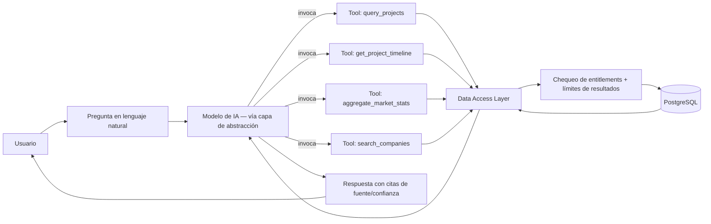

# 06 — Arquitectura de Transition AI

## 6.1 Principio rector

Transition AI es una **capa de interpretación sobre datos estructurados y controlados por el backend**, no un chatbot de propósito general ni un mecanismo de acceso libre a la base de datos. Su función es responder preguntas de negocio usando el dataset de Transition LATAM como única fuente de verdad, y hacerlo dentro de límites que protejan tanto la precisión (no inventar) como el activo de datos (no permitir extracción masiva).

## 6.2 Patrón: tool-calling sobre consultas controladas (no SQL libre, no RAG vectorial pesado)



**Por qué no SQL generado libremente:** un LLM que genera SQL arbitrario contra la base de datos es la forma más directa de perder el control de exfiltración masiva (ver [09-seguridad.md](09-seguridad.md)) y de introducir errores silenciosos. En su lugar, el modelo solo puede invocar un conjunto fijo y auditado de *tools* (funciones backend), cada una con:
- Parámetros validados y tipados.
- Límite máximo de filas devueltas (paginación forzada).
- Aplicación automática de entitlements del usuario (un usuario Free nunca recibe campos Enterprise, sin importar cómo formule la pregunta).
- Registro de auditoría de la invocación (ver [09](09-seguridad.md) §9.5).

**Por qué no RAG vectorial como mecanismo primario:** el dataset del MVP es mayormente estructurado (proyectos, empresas, relaciones, eventos) — se consulta mejor con filtros/agregaciones precisas que con similitud semántica. Se reserva la búsqueda vectorial para una fase futura, específicamente para contenido no estructurado (noticias, descripciones libres) cuando ese corpus exista (ver [05-arquitectura-tecnica.md](05-arquitectura-tecnica.md) §5.7).

## 6.3 Catálogo inicial de tools (MVP)

| Tool | Propósito | Límites |
|---|---|---|
| `query_projects` | Filtrar proyectos por tecnología, región, capacidad, estado, fechas | Máx. N filas por respuesta, paginación, campos restringidos por plan excluidos |
| `get_project_detail` | Detalle de un proyecto específico | Respeta campos restringidos y nivel de confianza |
| `get_project_timeline` | Eventos históricos de un proyecto | — |
| `aggregate_market_stats` | Agregados tipo dashboard (conteos, sumas de capacidad por dimensión) | Solo agregados, nunca fila-a-fila del dataset completo |
| `search_companies` | Buscar empresas/desarrolladores por nombre o rol | Paginado |

Nuevas tools se agregan de forma incremental y siempre pasan por el mismo enforcement de entitlements — no existe un camino alterno "directo a la DB" para ninguna tool nueva.

## 6.4 Capa de abstracción de proveedor de IA

```
/lib/ai
  /provider/           # Interfaz común: complete(), toolCall(), stream()
    anthropic.ts
    openai.ts           # implementación intercambiable
    index.ts            # selector por config/env, no hardcodeado en el resto del código
  /tools/               # Definición de tools + sus handlers (llaman a /lib/data-access)
  /guardrails/          # Prompts de sistema, reglas de citación, validación de salida
  /orchestrator.ts      # Orquesta pregunta → tool calls → respuesta final
```

Ningún módulo fuera de `/lib/ai/provider` debe importar el SDK de un proveedor específico. Esto permite cambiar o combinar proveedores (ej. un modelo económico para clasificar la intención de la pregunta, uno más capaz para la respuesta final) sin tocar el resto del sistema.

## 6.5 Guardrails de contenido (obligatorios)

1. **No inventar:** el system prompt y la validación de salida exigen que toda afirmación factual provenga de una tool call; si no hay dato, la respuesta debe decir explícitamente que no hay información disponible.
2. **Separar hecho de análisis:** las respuestas que combinan datos con interpretación (ej. "esto podría representar una oportunidad") deben marcar textualmente qué parte es dato y qué parte es análisis generado por IA — coherente con los niveles de confianza de [04-modelo-datos.md](04-modelo-datos.md) §4.3.
3. **Mostrar proveniencia cuando corresponda:** si el dato citado no es `VERIFICADO`, la respuesta debe indicar su nivel de confianza.
4. **Respetar permisos y plan:** la capa de tools nunca devuelve al LLM datos que el usuario no tendría derecho a ver — el LLM no puede "filtrar" lo que nunca recibió.

## 6.6 Límites de uso (ligado a suscripción y a seguridad)

| Control | Mecanismo |
|---|---|
| Consultas por período (día/mes) según plan | Contador en `ai_usage` + chequeo de entitlement antes de procesar |
| Resultados máximos por respuesta | Hard cap en cada tool, independiente del plan (ningún plan permite extracción masiva completa) |
| Rate limiting por usuario/IP | Middleware de API (ver [09-seguridad.md](09-seguridad.md) §9.2) |
| Detección de patrones de abuso (consultas repetitivas variando ligeramente para reconstruir el dataset) | Logging de consultas + heurística de alerta (ver [09](09-seguridad.md) §9.6) |

## 6.7 Transition AI como señal de intención (conexión con Lead Intelligence)

Cada consulta a Transition AI es también un evento de comportamiento capturado para el Intent Engine (ver [07-inteligencia-leads.md](07-inteligencia-leads.md)): qué preguntó, sobre qué tecnología/región/empresa, con qué frecuencia. La arquitectura de logging de consultas de IA debe ser reutilizable directamente como fuente de señales de intención, no un sistema paralelo.

## 6.8 Qué se pospone deliberadamente (fuera del MVP)

- Agentes de IA multi-paso autónomos (ej. que generen reportes completos sin supervisión).
- Fine-tuning de modelos propios.
- Búsqueda vectorial / embeddings.
- Personalización de modelo por usuario/organización Enterprise (mencionada en el brief como funcionalidad Enterprise futura).
