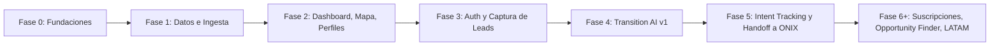

# 10 — Alcance del MVP y Roadmap

## 10.1 Alcance exacto del MVP (dentro)

1. Chile únicamente.
2. Modelo de datos completo de [04-modelo-datos.md](04-modelo-datos.md) (proyectos, empresas, SPVs, historial, proveniencia) — el modelo se construye completo aunque el volumen de datos inicial sea pequeño.
3. Dashboard público (SEO-ready).
4. Mapa interactivo con filtros server-side.
5. Perfil de proyecto con línea de tiempo y campos con control de acceso.
6. Transition AI v1 (tool-calling sobre datos estructurados, con guardrails).
7. Registro de usuario y onboarding progresivo.
8. Seguimiento básico de intención (captura de eventos crudos; scoring simple, no ML).
9. Captura de leads con notificación/exportación a un CRM vía adaptador genérico (webhook si no hay CRM confirmado aún).
10. Panel de administración interno mínimo para carga/edición de datos y ajuste de umbrales de scoring.
11. Sistema de entitlements funcionando desde el día 1, aunque en el MVP todos los usuarios operen en un plan Free efectivo.

## 10.2 Explícitamente fuera del MVP

- Marketplace transaccional completo.
- Billing/suscripciones con cobro real.
- Empresas y relaciones completo (la preparación, prueba de proveedores y modelo de proveniencia sí quedan dentro del alcance preparatorio; implementación comercial en Fase 6).
- Dataset multi-país real (solo el parámetro `country_code` existe).
- Agentes de IA complejos/autónomos.
- Microservicios separados (todo vive en el monolito Next.js + Supabase hasta que haya evidencia de necesidad).
- Opportunity Finder y Report Builder como funcionalidades completas (arquitectura preparada, no construidas — ver [02-prd.md](02-prd.md) §2.2).
- Búsqueda vectorial/semántica.

## 10.3 Fases de implementación

| Fase | Contenido | Depende de |
|---|---|---|
| **Fase 0 — Fundaciones** ✅ (2026-07-20) | Repo (Next.js 16 + TypeScript strict + Tailwind), estructura de carpetas de [05](05-arquitectura-tecnica.md), migraciones SQL del esquema completo + seed de referencia (país/regiones/tecnologías/fuentes/estados/features) + RLS base en `supabase/migrations` — **aplicadas y verificadas contra el proyecto Supabase real de ONIX**, RLS confirmado activo en todas las tablas de negocio, CI (lint+typecheck+build) en `.github/workflows/ci.yml` | Aprobación de esta documentación |
| **Fase 1 — Datos e Ingesta** 🟡 (2026-07-20) | Modelo de datos completo ✅, primera carga de proyectos Chile (2758 solicitudes reales, Nivel 1) ✅, Nivel 2 (Formulario: empresa/RUT/contactos/SPV) ✅ probado end-to-end contra 2 proyectos reales — falta: descarga automatizada real (URL/endpoint de Acceso Abierto sin confirmar) y panel de admin | Fase 0 |
| **Fase 2 — Dashboard, Mapa, Perfiles** ✅ (2026-07-20) | Dashboard público (stats + gráficos), listado con filtro por tecnología, mapa interactivo (MapLibre GL, burbujas por región + puntos precisos cuando hay coordenadas reales), perfil de proyecto con historial real y stakeholders (protegidos por RLS) — verificado en navegador y build de producción | Fase 1 |
| **Fase 3 — Auth y Captura de Leads** | Registro/onboarding, `user_profile`, captura de `behavior_event`, sistema de entitlements base | Fase 2 (puede solaparse parcialmente) |
| **Fase 4 — Transition AI v1** | Capa de abstracción de proveedor, catálogo inicial de tools, guardrails, límites de uso | Fase 1 y 3 |
| **Fase 5 — Intent Tracking y Handoff** | Lead scoring simple, umbral configurable, adaptador de CRM (webhook mínimo), notificaciones | Fase 3 y 4 |
| **Fase 6+ (post-MVP)** | Activación de suscripciones/billing, Opportunity Finder, Report Builder, expansión a Perú y módulo Empresas y relaciones — grupo, SPV, cartera consolidada, contactos y alertas; ver [alcance aprobado](superpowers/specs/2026-07-28-empresas-y-relaciones-scope.md) | Validación del MVP + prueba de proveedor societario |

Las fases 2 y 3 pueden ejecutarse con solapamiento (equipos distintos); las fases 4 y 5 dependen de que exista dataset real cargado (Fase 1) para que Transition AI y el scoring tengan sobre qué operar — no tiene sentido construir IA sobre datos vacíos.

## 10.4 Próximos 5 pasos concretos (post-aprobación de esta documentación)

1. ~~Confirmar con ONIX las ambigüedades críticas~~ — **Actualizado (2026-07-20):** fuente de datos, stack (Supabase) y estado del CRM ya confirmados (ver [ADR-011](DECISIONS.md#adr-011--fuente-primaria-de-datos-energía-abierta-cne-solicitudes-de-conexión-coordinador-eléctrico-nacional), [ADR-012](DECISIONS.md#adr-012--supabase-confirmado-como-decisión-no-solo-recomendación), [ADR-013](DECISIONS.md#adr-013--crm-de-onix-pendiente-de-creación)). Queda pendiente solo el umbral de lead calificado (§2.5 #3 de [02-prd.md](02-prd.md)) y las preguntas abiertas de mapeo de fuente en [04-modelo-datos.md](04-modelo-datos.md) §4.8–§4.9 (URL/API exacta de descarga, frecuencia, relación Energía Abierta ↔ Coordinador).
2. Inicializar el repositorio (Next.js + TypeScript + Supabase), estructura de carpetas de [05-arquitectura-tecnica.md](05-arquitectura-tecnica.md), CI básico.
3. Escribir las migraciones SQL del modelo de datos de [04-modelo-datos.md](04-modelo-datos.md) (entidades núcleo: `project`, `company`, `spv`, `data_source`, `data_attribution`, `project_event`) junto con policies RLS base.
4. Cargar un primer dataset semilla de proyectos Chile usando las fuentes ya confirmadas (Energía Abierta + Solicitudes de Conexión) y construir el conector/diff descrito en [04-modelo-datos.md](04-modelo-datos.md) §4.8 y [05-arquitectura-tecnica.md](05-arquitectura-tecnica.md) §5.10. Incorporar SEIA como tercera fuente cuando ONIX comparta ese dataset.
5. Construir el dashboard público y el perfil de proyecto (Fase 2) como primer entregable visible, ya que es la base del SEO/tráfico que todo el resto del funnel depende.
